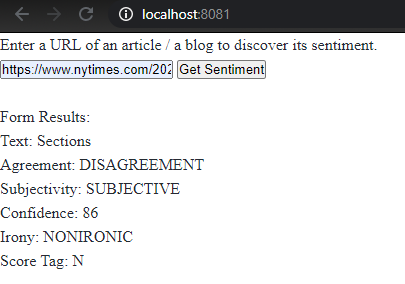

## Evaluate News Article  with Natural Language Processing

Starter code at [Udacity](https://www.udacity.com/course/react-nanodegree--nd019).

This project allows users to analyze an article of their choice by providing its url. The project uses the [meaning cloud API](https://www.meaningcloud.com/) to analyze the article.

### Steps to run the project

1. Install npm
```
npm install
```

2. Install node fetch
```
npm install node-fetch
```
3. To run jest tests
```
npm run test
```
4. To run server
```
npm run start
```
and then go to http://localhost:8081/

### Sample Run

- In the case of an invalid URL, an invalid url warning appears to the user in red.


- In the case of a valid url entry, the user receives the sentiment of the article url in the form results.




- A run of the jest tests

